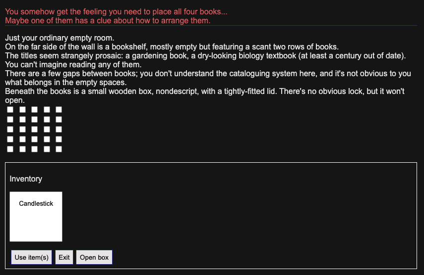

# Cosmic Refresh

This project contains a short text-based puzzle mystery game implemented by

* [Misty De Méo](https://github.com/mistydemeo)
* [Arcadia Rose](https://github.com/arcadia-rose)

during Shopify's Hackdays in March 2022.

Our game features a variety of mechanics centering around a narrative delivered to the player through text.  The player uses on-screen buttons to take a variety of actions such as collecting & using items and navigating between rooms in the game's setting.  The game also features some small puzzles and a story that is revealed through the player's interactions.

# How to play

This game is implemented in Go, compiled to [WASM](https://webassembly.org/) using the standard compiler.  It also has a JavaScript component that interfaces with the Go-based game engine and drives DOM manipulations to provide the user interface.

[Dev](https://github.com/Shopify/dev) tasks exist to perform the steps required to run the game.  No external tools or libraries need to be downloaded to play.

1. Run `dev build` to compile the WASM asset.
2. Run `dev server` to run the file server.
3. Navigate to `localhost:9090` in your browser to begin playing.

At the top of each page you will see, from top to bottom:

1. Important notifications appear in red text.
2. Narrative story content appears in black text.
3. Your inventory is located within a bordered box.
4. Items in your inventory can be selected from the multi-select field.
5. Available actions can be performed on contents of the room or using items via buttons.

Puzzles may also appear which require creative solutions based on items and hints provided throughout the game's setting.
